# Favourites Group Addon for Kodi

##### Purpose:

This addon allows saving of Kodi elements (addons,folders,media, and endpoints) to a group similar to the built-in favourites feature. The main enhancement is that multiple independent named groups of elements can be created each having a different combination of elements.

##### Implementation:

A new global context menu item is added to Kodi, called "Add to FavouriteGroup" which should be present in most of the locations that the "Add to favourites" context menu item is also available.

In many of the customizable skins, new menu options can be added that invoke a specific Favourite Group, or the Group of Groups master list.

New named Favourite Groups can be added or deleted at any time.

Kodi elements can be added to one or more Favourite Group in one operation.

##### Installation:

See the installation instructions document: [kodirepo/README.md at master · Fillimerica/kodirepo](https://github.com/Fillimerica/kodirepo/blob/master/README.md)

##### Usage:

A new context menu item will be present called "Add to FavouriteGroup" in most areas of Kodi. Navigate to the desired addon, folder, media, or endpoint, bring up the context menu, and select "Add to FavouriteGroup"

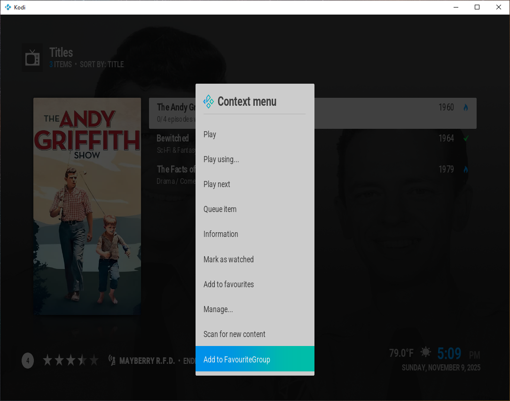

The Desired Item Name diolog will be shown with the current item name displayed. Optionally edit the name to reflect the specific content being linked, and choose "Done" to continue. Selecting a completely blank Item Name will cancel the Add to FavouriteGroup operation.

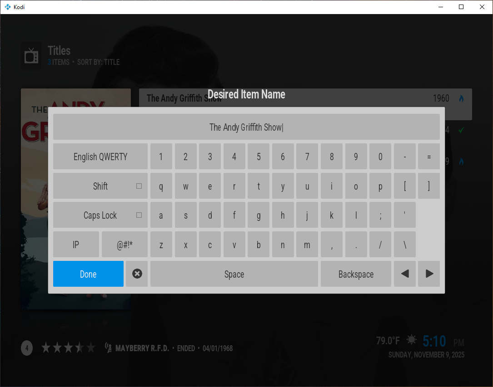

The Group Selection dialog will be displayed. If named Favourites Groups exist, they will be listed along with the special "<NEW GROUP>" group. Select one or more groups to add the item into. Select "<NEW GROUP>" to create a new named Favourites Group. Then Press OK to continue. Selecting CANCEL will will cancel the Add to FavouriteGroup operation.

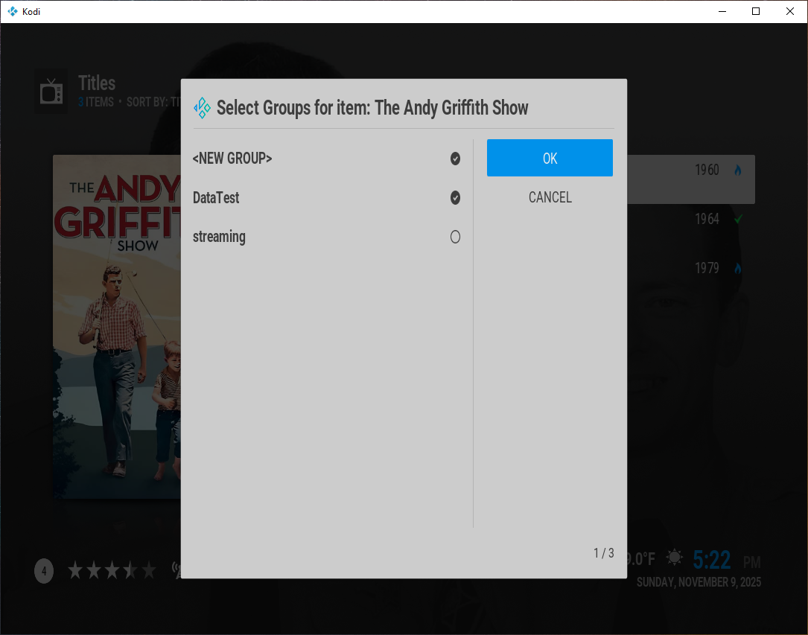

If "<NEW GROUP>" was chosen, you will be prompted for a group name. Please use characters that are valid for filenames in your operating system. (Limited checks are done to determine if the entered name is valid.)

If the Add to Favourite Group was successful, a notification will appear in the upper corner:

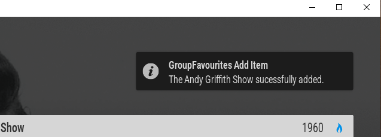

##### Usage Part 2

Once one or more Favourite Groups have been created, you may access them from either the addon directly or via the url of a specific group.

The most likely place to implement this is in the menu customization feature of a skin.

When run from the Addon menu directly (as can be done with the Estuary Skin), initially all of the Favourite Groups will be listed. Once a specific group is selected, the group items will be displayed. The specific group can be added to the global favorites which will provide direct access. This allows sub-dividing the global favourites into sub-categories.

When working with a skin that allows direct menu customization, a specific Favourite Group can be added directly to the menu or sub-menu.

##### Existing Group Operations

Existing Groups can be Deleted and have their associated thumbnail image changed.

##### Manipulating Existing Groups

1. Navigate to a view that shows the group containers (as opposed to a specific group's content). 
   
   * One way to do this is to launch the addon from the Kodi addon menu. 
   
   * For skins that allow custom menu links, use either of these actions: 
     
     * RunAddon("plugin.groupfavourites.tjf")
     
     * ActivateWindow(Videos,"plugin://plugin.groupfavourites.tjf,return)

2. From the list of Favourite Groups, select a group and bring up the context menu. (Right mouse or "c" on the keyboard)

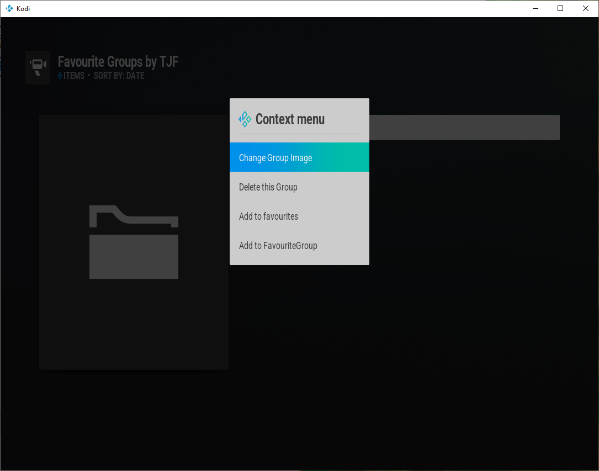

###### Changing the Thumbnail Image

1. Select "Change Group Image" from the context menu.

2. Navigate to the desired image and select it.

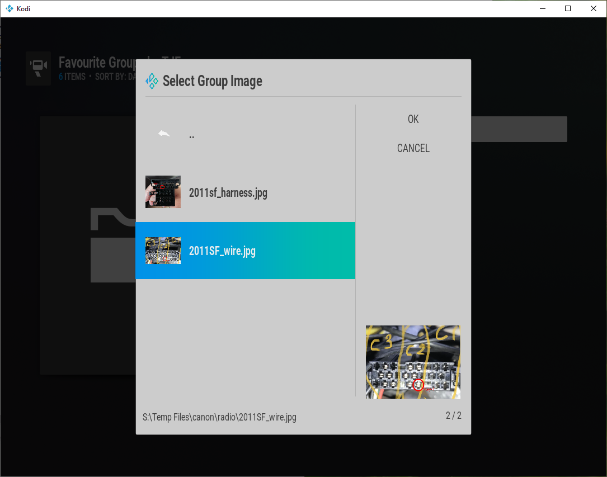

The selected image will be associated with the Favorite Group, and will be displayed by Kodi whenever the Favorite Group appears in a list.

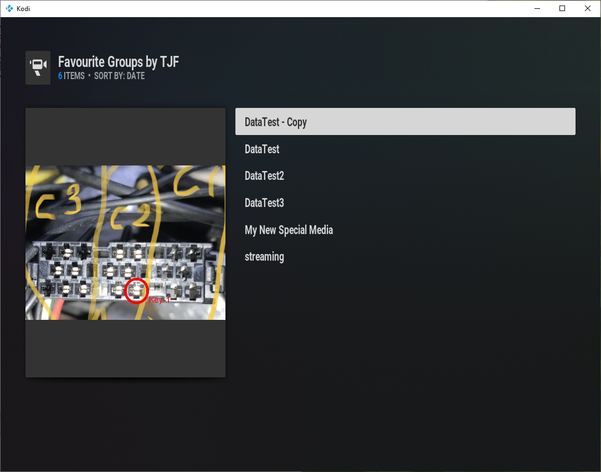

###### Deleting a Group

1. Select "Delete this Group" from the context menu.

2. A confirmation dialog will be shown. Verify that the Group Name shown in the dialog is the one intended to be deleted.

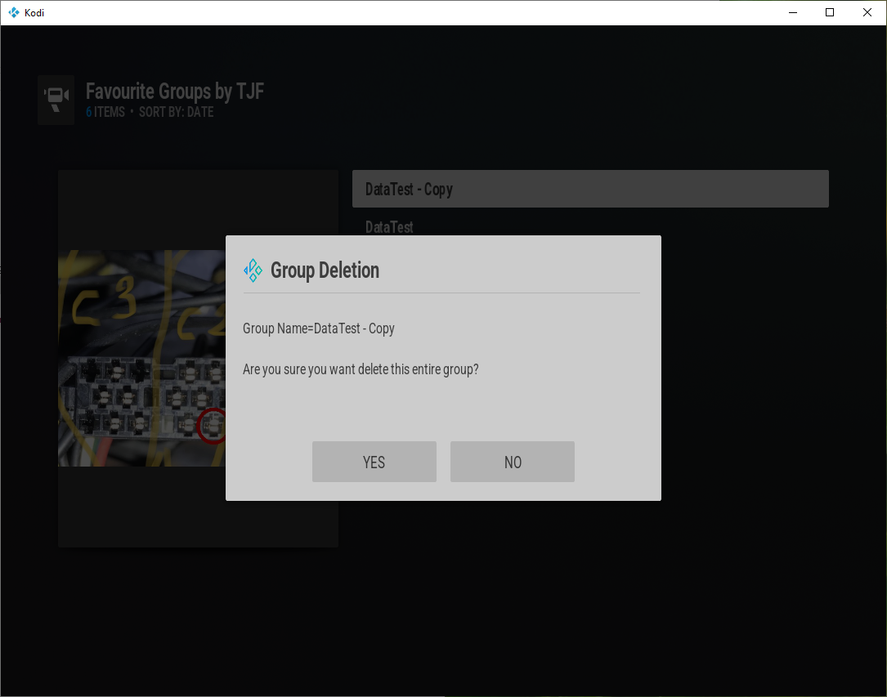

3. Select "Yes" to confirm group deletion. Select "No" to cancel the deletion request.
   
   *Note: Group deletion erases only the Favourite Group xml file. The items referenced within the group are not deleted.*

##### Existing Item Operations

Items within Groups can be re-ordered, can have their associated thumbnail image changed, can have their name changed, and can be removed from the group.

*Note: If an item is present in multiple groups, only the current group being displayed is affected. Other groups remain unchanged.*

1. Navigate into a Favourite Group so that its contents appear in a Kodi list.

2. Select the desired item from the list.

3. Bring up the context menu. (Right mouse or "c" on the keyboard). The item context menu will appear:

##### Changing the Item Order Within the Group

    *Note: There must be at least two items in the group for the order options to be listed in the context menu.*

    *In addition, only the reordering options that are valid for the selected item will be listed in the context menu.*

* Select "Move Up" to move the item up in the list. The selected item trades places with the item immediately above it.

* Select "Move Down" to move the item down in the list. The selected item trades places with the item immediately following it.

Once an item is moved, the on-screen list is updated to reflect the new position. The Group xml file is also updated to reflect the new order.

##### Changing the Item Thumbnail Within the Group

1. Select "Change Thumbnail" from the context menu.

2. Navigate to the desired image and select it.

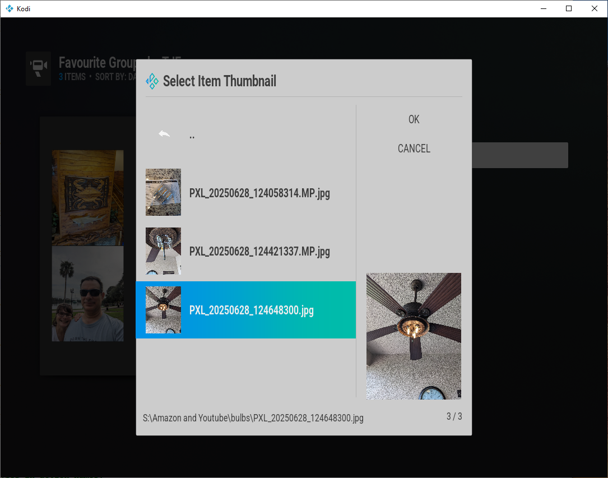

The selected image will be associated with the item only within the group, and will be displayed by Kodi whenever the Group's contents are being shown.

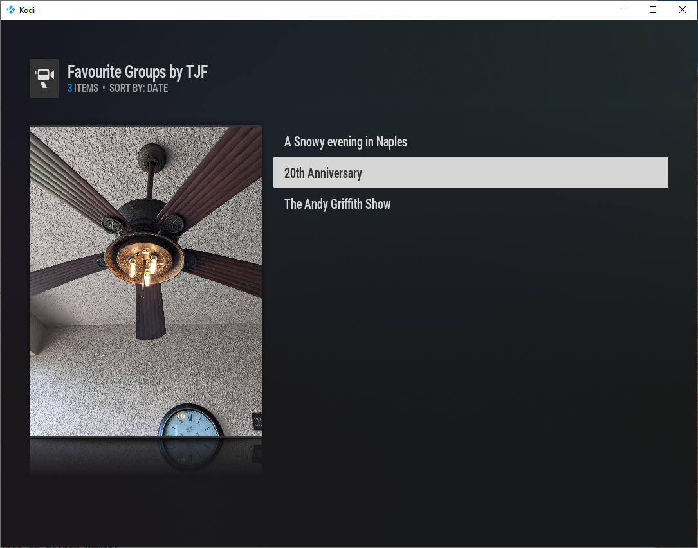

##### Changing the Item Name Within the Group

1. Select "Rename Item" from the context menu.

2. An on-screen keyboard will be displayed by Kodi. Enter the new desired item name.

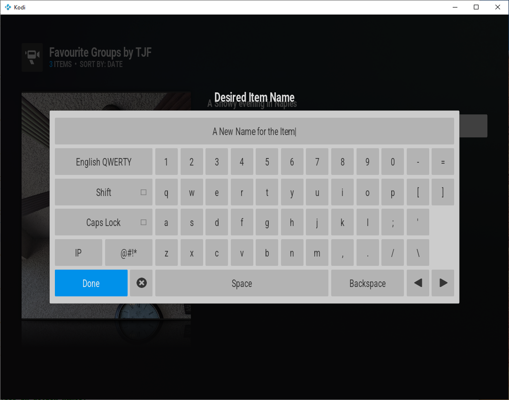

3. Press "Done" when finished editing to close the keyboard. The new name will be shown in the list and updated in the group xml file.
   
   *Note: Changing the item's name in a group only affects the visual display within that group. Other groups and places where the item may be listed will not be changed.*

###### Removing the Item From the Group

1. Select "Remove from FavouriteGroup" from the context menu.

2. A confirmation dialog will be shown. Verify that the Item Name shown in the dialog is the one intended to be removed.

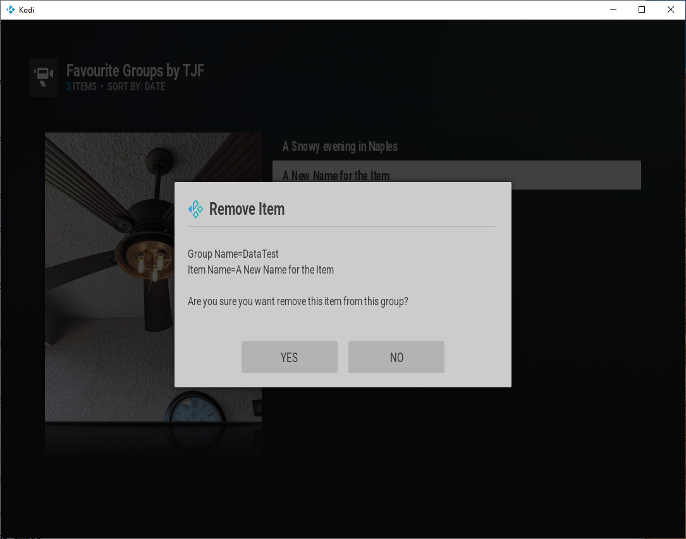

3. Select "Yes" to confirm item removal. Select "No" to cancel the removal request.

### Controlling Access to Group and Item Operations

Any or all Group and Item Operations can be disabled. The actions will still appear in the context menu, but if selected while disabled an informational dialog will be displayed instead.
Example (item rename attempted while disabled):

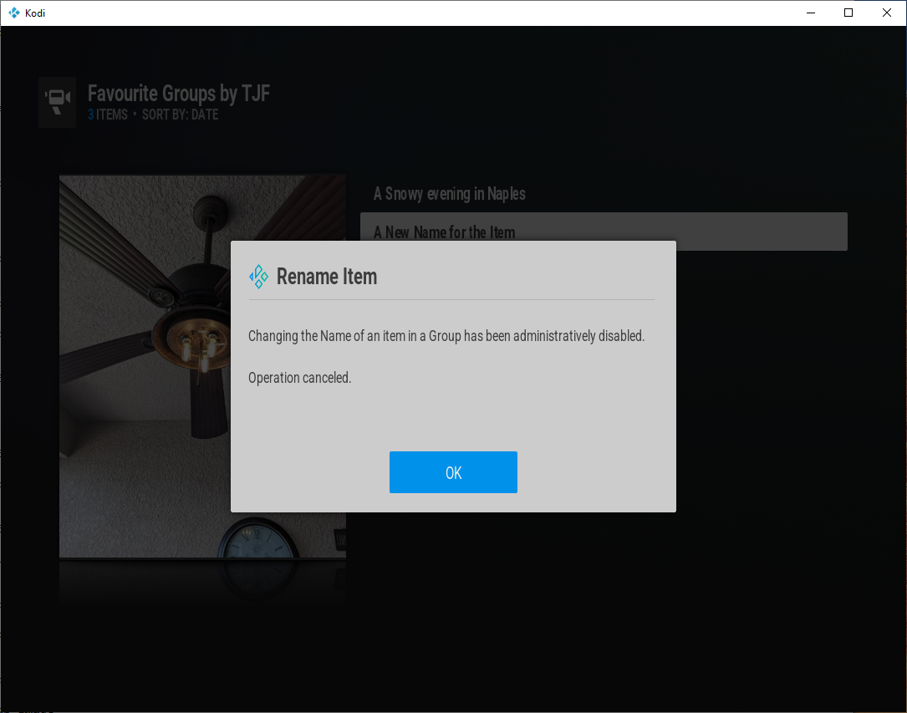

###### Configuring Access to Group and Item Operations

1. Navigate to the addon's configuration page. (Settings,Add-ons,My Add-ons, All, Favourite Groups by TJF, Configure)

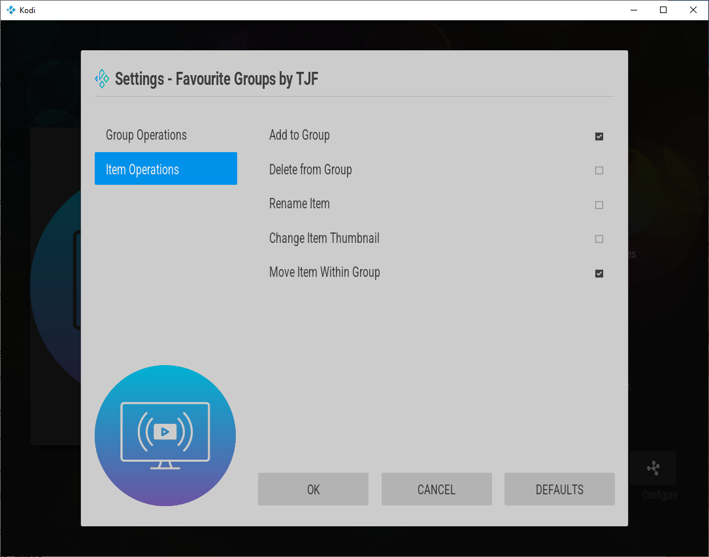

   There are two sections, Group Operations, and Item Operations.

2. Remove the checkmark next to any Group or Item Operation that should be disabled.

3. Press "OK" to save the selections.
   
   Note: This configuration page is meant to keep casual users such as family members from permanently changing the Favorite Groups. It is not intended as a security system.

End of FavouriteGroups Documentation
